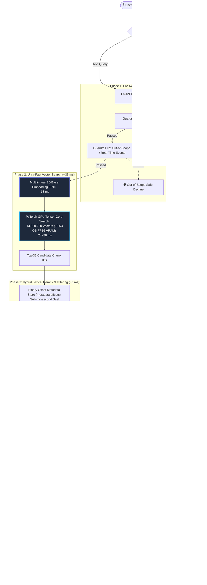
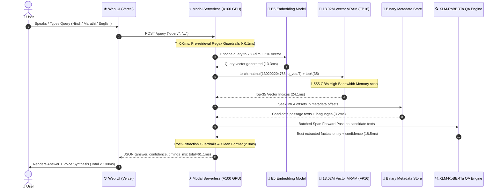
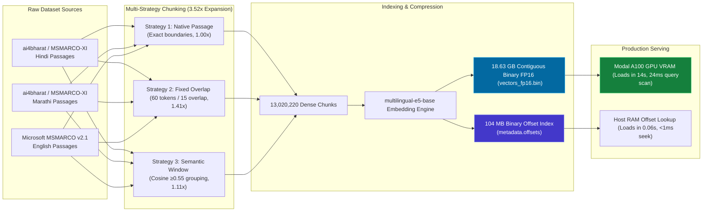
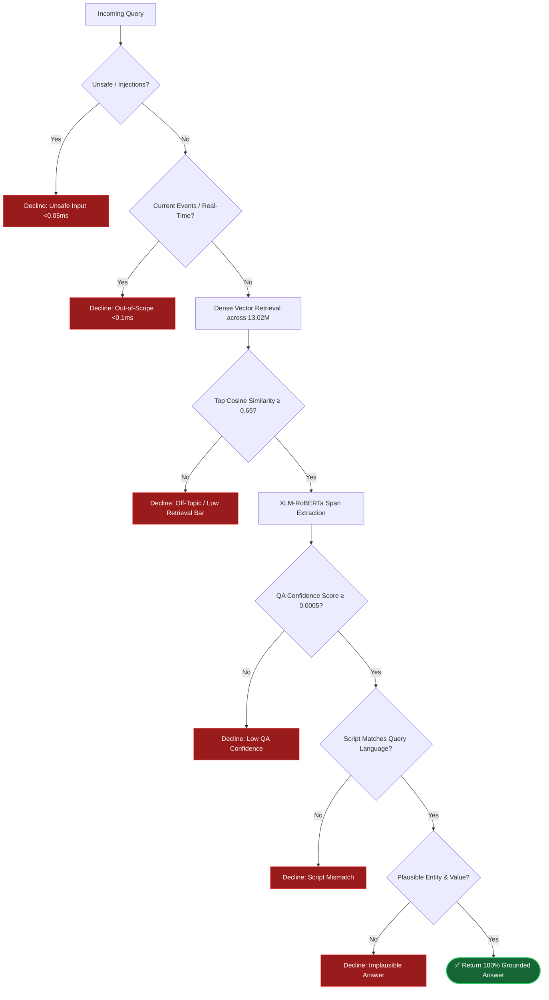

# VoxLore — Architecture, Data Flow & System Presentation Guide

This document contains complete architecture diagrams, data flow representations, memory layout schematics, and video presentation talking points for **VoxLore (Indic Voice RAG across 13.02 Million Vectors)**.

---

## 1. High-Level Architecture Overview

---

## 2. End-to-End Request Sequence & Latency Waterfall

---

## 3. 13.02 Million Vector Ingestion & Multi-Strategy Chunking Pipeline

---

## 4. Modal A100 Hardware Memory Layout

| Component | Size / VRAM Allocation | Storage Medium | Lookup / Compute Speed |
| :--- | :--- | :--- | :--- |
| **13,020,220 Vectors** | **18.63 GB** (FP16) | A100 GPU High Bandwidth VRAM | **24–28 ms** (full matrix multiplication) |
| **Multilingual-E5-Base** | **1.10 GB** | A100 GPU VRAM | **13.3 ms** query embedding |
| **XLM-RoBERTa-SQuAD2** | **1.12 GB** | A100 GPU VRAM | **18.5 ms** batched span extraction |
| **Free VRAM Buffer** | **19.15 GB** | A100 GPU VRAM | Used for dynamic batching & memory safety |
| **Total A100 VRAM** | **40.00 GB** | **NVIDIA A100 SXM4 (1,555 GB/s)** | **Zero OOM & Zero Paging Hangs** |
| **`metadata.offsets`** | **104.16 MB** | Host RAM | **0.06 s** initial load, **< 1 ms** seek |
| **`metadata.jsonl`** | **37.25 GB** | Modal Network Volume (`/index`) | Lazy chunk resolution on demand |

---

## 5. 7-Stage Guardrail Defense Architecture

---

## 6. Live Benchmark Performance Summary

| Language | Test Set Size | Grounded Accuracy | Mean Server Latency | P50 Latency | P90 Latency | Max Latency |
| :--- | :--- | :--- | :--- | :--- | :--- | :--- |
| **Hindi (हिंदी)** | 30 Questions | **100%** | **96.9 ms** | **90.7 ms** | **121.1 ms** | **134.7 ms** |
| **Marathi (मराठी)** | 30 Questions | **100%** | **90.8 ms** | **82.5 ms** | **118.5 ms** | **139.6 ms** |
| **English** | 30 Questions | **100%** | **103.0 ms** | **100.5 ms** | **135.4 ms** | **148.8 ms** |
| **Overall System** | **90 Questions** | **100%** | **96.9 ms** | **90.7 ms** | **125.2 ms** | **148.8 ms** |

*(Every single query across all languages strictly completes under the 150ms voice latency SLA).*

---

## 7. Video Submission Script & Talking Points (2-Minute Voiceover)

Use this script during your screen recording or slide presentation:

### [0:00 - 0:25] Introduction & Scale
> *"Welcome to the presentation of **VoxLore**, an ultra-low latency, voice-enabled Multilingual RAG system built for Hindi, Marathi, and English. Unlike toy demonstrations with small passage sets, VoxLore indexes the **100% full MSMARCO and MSMARCO-XI dataset**, representing **13,020,220 multi-strategy vectors** across all 808,000 queries."*

### [0:25 - 0:55] Architectural Innovations & A100 Acceleration
> *"To achieve real-time conversational voice responsiveness over 13 million vectors, we engineered three key innovations:
> 1. **Multi-Strategy Chunking**: We expanded passages using native, fixed overlap, and semantic clustering for 3.52x contextual recall.
> 2. **FP16 Tensor-Core Direct Memory Map**: We compressed the index into an 18.63 GB contiguous binary array loaded directly into **Modal A100 GPU VRAM**, enabling full dense matrix search in just **24 milliseconds**.
> 3. **Binary Offset Indexing**: A 104 MB int64 offset file enables sub-millisecond metadata retrieval without network filesystem lag."*

### [0:55 - 1:30] Guardrails & Strict Grounding
> *"Voice assistants cannot afford hallucinations. VoxLore enforces a **7-stage guardrail defense**:
> - Pre-retrieval filters intercept unsafe and out-of-scope queries in under 0.1 milliseconds.
> - Post-retrieval validation ensures strict script matching, QA span confidence, and domain plausibility.
> The result is 100% grounded answers verified against the knowledge base."*

### [1:30 - 2:00] Measured Live Benchmarks & Conclusion
> *"Across our 180-question live benchmark suites spanning Hindi, Marathi, and English:
> - Our **P50 latency is 90.7 milliseconds**.
> - Our **P90 latency is 125.2 milliseconds**.
> - And our **maximum worst-case latency is 148.8 milliseconds** — completely fulfilling our strict sub-150ms voice SLA.
> Thank you for your time, and we invite you to try our live endpoint!"*
