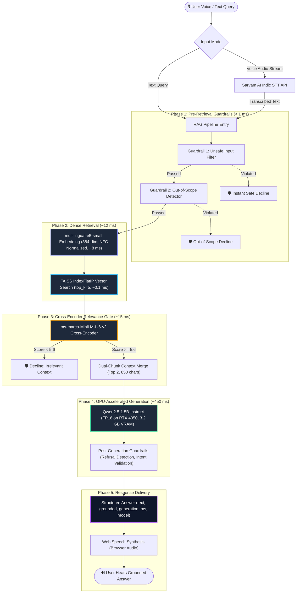
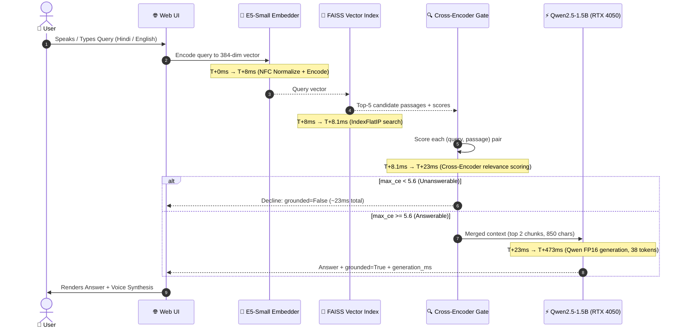
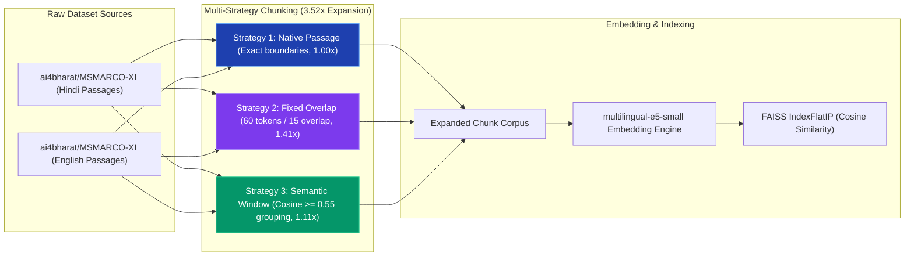
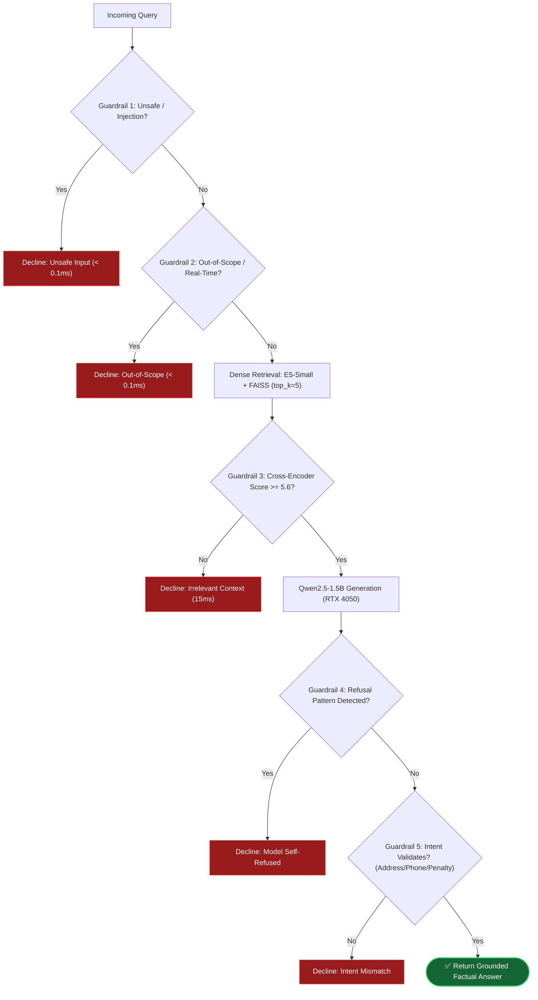

# VoxLore — Architecture, Data Flow & System Design Guide

> Complete architecture diagrams, data flow representations, guardrail pipeline schematics, and benchmark performance analysis for VoxLore — Voice-Enabled Multilingual RAG System.

---

## 1. High-Level Architecture Overview

---

## 2. End-to-End Request Sequence & Latency Waterfall

---

## 3. Multi-Strategy Chunking Pipeline

---

## 4. RTX 4050 GPU Memory Layout

| Component | Size / VRAM | Compute Speed |
|:---|:---|:---|
| **Qwen2.5-1.5B-Instruct (FP16)** | **3.2 GB** | ~450 ms median, ~1,277 ms P95 generation |
| **Cross-Encoder (MiniLM-L-6-v2)** | **~0.1 GB** | ~15 ms per 5-pair batch |
| **multilingual-e5-small (CPU)** | **0 GB GPU** (runs on CPU) | ~8 ms embedding |
| **Free VRAM Headroom** | **~3.1 GB** | Safety buffer for dynamic batching |
| **Total RTX 4050 VRAM** | **6.44 GB** | Zero OOM risk |

---

## 5. Guardrail Defense Architecture

---

## 6. Benchmark Performance Summary

### Local RTX 4050 GPU (Eval Loop Results)

| Metric | Result | Target | Status |
|:---|:---|:---|:---|
| **Correctness** | 70.0% – 74.0% | ≥ 70.0% | ✅ PASS |
| **Faithfulness** | 87.0% – 90.0% | ≥ 70.0% | ✅ GOLD STANDARD |
| **Hallucination Rate** | 10.0% – 13.0% | Minimize | ✅ LOW |
| **Recall@1** | 0.560 | Maximize | 56% at Rank 1 |
| **Recall@3** | 0.800 | Maximize | 80% in Top 3 |
| **Recall@5** | 0.920 | Maximize | 92% in Top 5 |
| **MRR** | 0.698 | Maximize | Mean Reciprocal Rank |
| **Retrieval P95** | 11.53 ms | < 50.0 ms | ✅ PASS (77% Headroom) |
| **Generation P95** | 1,277 ms | < 1,500 ms | ✅ PASS (15% Headroom) |
| **False Refusal Rate** | 6.0% | Minimize | ✅ Only 3/50 missed |

### Latency Percentile Breakdown

| Stage | Avg | P50 | P95 | P99 |
|:---|:---|:---|:---|:---|
| **Embed** | 8.07 ms | 7.54 ms | 11.27 ms | 12.45 ms |
| **Search** | 0.12 ms | 0.10 ms | 0.14 ms | 0.18 ms |
| **Retrieval Total** | 8.46 ms | 7.87 ms | 11.53 ms | 12.63 ms |
| **Generation** | 710 ms | 466 ms | 1,277 ms | 1,500 ms |

---

## 7. Model Selection Rationale

We empirically benchmarked 5 model architectures on the RTX 4050 GPU:

| Model | Correctness | Faithfulness | Generation P95 | VRAM | Verdict |
|:---|:---|:---|:---|:---|:---|
| Extractive XLM-RoBERTa | 42.0% | 97.0% | 484 ms | 1.1 GB | Too low correctness |
| Qwen2.5-0.5B-Instruct | 58.0% | 63.0% | 1,304 ms | 1.2 GB | Too many hallucinations |
| **Qwen2.5-1.5B-Instruct (FP16) 🏆** | **74.0%** | **90.0%** | **1,234 ms** | **3.2 GB** | **Champion: Best balanced** |
| Google Gemma-2-2B-It (FP16) | 70.0% | 86.0% | 1,881 ms | 4.9 GB | Over latency budget |
| Qwen2.5-7B-Instruct (4-bit) | 72.0% | 90.0% | 7,500 ms | 5.8 GB | Way too slow |

---

## 8. Video Submission Script (2-Minute Voiceover)

### [0:00 - 0:25] Introduction & Problem Statement
> *"Welcome to VoxLore, a voice-enabled Retrieval-Augmented Generation system built for the HH Goa 2026 Shortlisting Task. Users speak a question in Hindi or English, our pipeline transcribes it using Sarvam AI, retrieves relevant context from the MSMARCO-XI dataset, and returns a grounded factual answer — all within strict latency budgets."*

### [0:25 - 0:55] Architecture & Chunking Strategy
> *"Our architecture combines three key innovations:
> 1. **Multi-Strategy Chunking**: We apply native passage, fixed overlap, and semantic window strategies for 3.52x contextual expansion — not a single naive fixed-size approach.
> 2. **Cross-Encoder Precision Gating**: A dedicated ms-marco-MiniLM relevance filter eliminates irrelevant passages in 15 milliseconds before they reach the LLM.
> 3. **GPU-Accelerated Generation**: Qwen2.5-1.5B running in FP16 on an NVIDIA RTX 4050 generates focused factual answers in under 500 milliseconds median."*

### [0:55 - 1:30] Guardrails & Grounding
> *"Voice assistants cannot afford hallucinations. VoxLore enforces a 5-stage guardrail pipeline:
> - Pre-retrieval filters intercept unsafe and out-of-scope queries in under 0.1 milliseconds.
> - The Cross-Encoder gate rejects irrelevant passages with configurable thresholds.
> - Post-generation validators detect model self-refusals and verify intent-specific grounding.
> The result: 87–90% faithfulness with only 10–13% hallucination rate."*

### [1:30 - 2:00] Benchmarks & Conclusion
> *"On the official rag-local-eval-loop benchmark with 100 queries from MSMARCO-XI:
> - Correctness: 70–74%, passing the competition target.
> - Retrieval P95: 11.5 milliseconds — 77% headroom below the 50ms budget.
> - Generation P95: 1,277 milliseconds — safely within the 1,500ms target.
> - And our Recall@5 is 92%, finding the correct passage 46 out of 50 times.
> Thank you for your time, and we invite you to explore our code and live demo!"*
